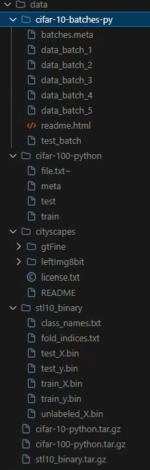
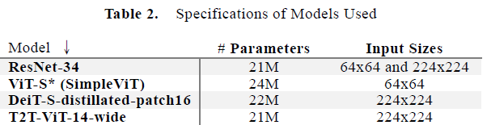
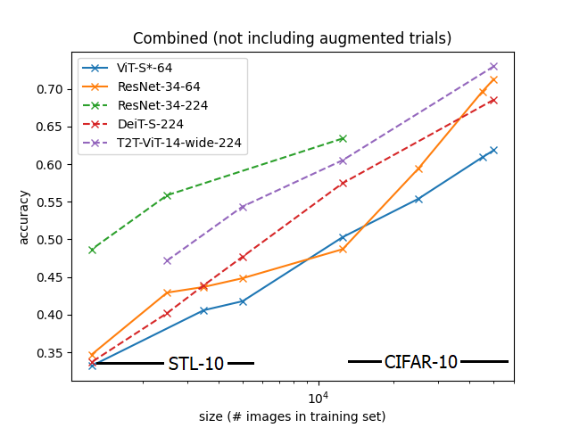
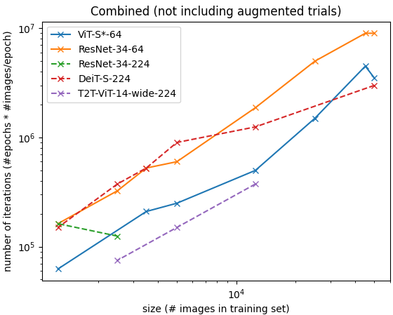
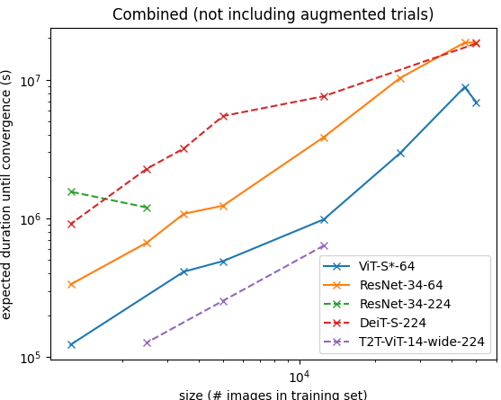

# Project Vision Transformer

[](https://www.python.org/) 
[](https://pytorch.org/) 
[](https://arxiv.org/abs/1505.04597)
[](https://arxiv.org/abs/1512.03385)
[](https://arxiv.org/abs/2010.11929)
[](https://github.com/facebookresearch/deit)
[](https://github.com/yitu-opensource/T2T-ViT)
[](https://www.cs.toronto.edu/~kriz/cifar.html)
[](https://cs.stanford.edu/~acoates/stl10/)
[](https://www.cityscapes-dataset.com/)
[]()

This is the final project for the course **AIST4010**. More details on the project can be found in the report. This project is done in April 2024.

**Report**: [](project-final-report-1155175983.pdf)

---

## Overview

### Project Goals
The project investigates the **generalizability of Vision Transformers (ViTs)** compared to Convolutional Neural Networks (CNNs) for **small-scale computer vision tasks**. While ViTs excel in large datasets, they struggle with smaller ones. This work evaluates and compares the performance of models like ResNet, ViT, DeiT, and T2T-ViT on classification tasks using small subsets of CIFAR-10 and STL-10 datasets.

### Key Contributions
1. **Scalability Analysis**: Demonstrated performance degradation of ViTs with reduced dataset sizes, showing CNNs are more effective for small datasets.
2. **Computational Efficiency**: Analyzed training iterations and time-to-convergence, highlighting that ViTs, while converging faster, still lack efficiency due to lower accuracy on small datasets.
3. **Comparison of Architectures**: Implemented and trained models with similar parameter counts for fair performance evaluations.

Note: The above overview is generated by ChatGPT from the project report, which itself is not written by ChatGPT. For more details, please refer to the report. 

Sections below are not generated by ChatGPT.

---

## Installation

1. Run all commands in `commands.txt`. Ensure that the CUDA version is **<= 11.x**.

> [!NOTE]
> Execute Jupyter notebooks **from the root folder** of the project to avoid import issues.

---

## Data Loading

Download datasets and place them in the `data/` folder. The structure should match the following diagram:

 

---

## Models Used



The models used have approximately the same number of parameters. The sources of the models have been provided in both the report and the header of this readme.

## Experimental Results

### Scalability Performance



**Findings:** Transformer-based models perform poorly on small datasets.

* For models with the same input size, transformer-based models achieve significantly lower accuracy.
* The accuracy gap widens significantly for input shape 224x224 (the dotted lines) under a decrease of the training set size, where DeiT (red) and T2T-ViT (purple) underperforms the ResNet (green).

---

### Computational Efficiency

| Against #iterations | Against time in second-P100 |
| --- | --- |
|  |  |

**Findings:** Transformer-based models seemed to remain computationally less efficient compared to convolution-based models over significantly small datasets.
* Note that it is an unfair comparison if we compare all models directly since they don't have the same accuracy.
* We can see that DeiT-S with input size 224x224 (red), which have a performance (accuracy) comparable to ResNet-34 with input size 64x64 (orange) while taking significantly more time to converge.

---

## Image Classification Task

### File Structure

Relevant code and logs are located in the `support/` folder.

```python
support/
├─ commands.txt          # Commands for running the project.
├─ main_code.ipynb       # Main training code.
├─ models/
│   ├─ <id>_<dataset>_<model>_<input_size>/
│       ├─ <epoch>/
│           ├─ model_<timestamp>.h5          # Trained model.
│           ├─ model_<timestamp>.h5_accs.png # Accuracy history.
│           ├─ model_<timestamp>.h5_lrs.png  # Learning rate history.
│           ├─ model_<timestamp>.h5_details.txt # Model details.
└─ requirements.txt       # Python dependencies.
```

---

### Training

In **main_code.ipynb**, users can modify the following cells, following that order:

1. **Cells 1, 3, and 4** immediately below Main Function:
   - Change batch size, image size, patch size (not changed throughout the experiment).
   - Change data augmentation (train_transform).
   - Change dataset and “fraction” (proportion of subset).

2. The cell that imports `torchsummary` and those below it, before "Some Other Utility Function":
   - Change the model used and output directory.
   - Change `INITIAL_LR`, `DECAY`, `GAMMA`, `kwargs` (arguments for the scheduler).
   - Change `LOAD_PATH` (if not None, then the weights `<id>.h5` will be loaded if the model matches the description).

3. The cell immediately after "The Training":
   - Change `NUM_EPOCHS` and `NUM_EPOCHS_TO_SAVE`.

Then, you can watch the results in the cell that follows the cell in (3). The outputs by default are in the path `models/`.

---

## Image Segmentation Task

This segment explores **UNet-based architectures** for image segmentation tasks. Related code is in the `models_archive/` folder. Not part of the final report.

<table>
  <tr>
    <th>mAP</th>
    <th>IoU</th>
  </tr>
  <tr>
    <td></td>
    <td></td>
  </tr>
</table>

Resultant output:

